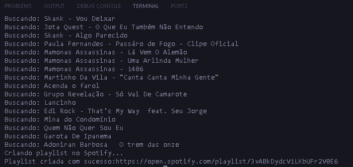

# YouTube → Spotify Playlist Sync 🎵

Script em **Python** que lê uma **playlist do YouTube** e cria **uma playlist idêntica no Spotify**, adicionando automaticamente as faixas encontradas.

> ✅ Ideal para migrar playlists ou estudar integração entre APIs, OAuth2 e automação com Python.

---

## 📸 Demonstração (execução)

  
*Exemplo de execução do script criando a playlist no Spotify*

---

## 🚀 Funcionalidades

- Autenticação via **Google OAuth2** para ler playlists do YouTube.  
- Autenticação via **Spotify OAuth2** (Spotipy) para criar/modificar playlists.  
- **Limpeza automática** dos títulos (remove `[Ao Vivo]`, `(Vídeo Oficial)` etc).  
- Criação de playlist no Spotify com as faixas encontradas.  
- Log simples no terminal mostrando progresso e o link final da playlist.

---

## 🧱 Arquitetura (alto nível)

1. Ler itens da playlist do YouTube (`playlistItems().list`).
2. Limpar títulos com **regex**.
3. Pesquisar cada faixa no Spotify (`sp.search`).
4. Criar uma playlist e adicionar as faixas encontradas.

---

## 📋 Pré-requisitos

- **Python 3.10+**
- Conta no **Spotify** com permissão para criar playlists.
- Projeto no **Google Cloud Console** com a **YouTube Data API v3** habilitada e o arquivo `credentials.json` baixado.
- Um **Redirect URI** configurado no app do Spotify (ex.: `http://127.0.0.1:8888/callback`).

---

## 🗺️ Roadmap

- [ ] Suporte a playlists privadas (YouTube/Spotify)
- [ ] Heurísticas melhores de busca (artista, duração, *fuzzy matching*)
- [ ] Evitar duplicatas e manter ordem exata da playlist
- [ ] CLI com argumentos (`--playlist-id`, `--name`)
- [ ] Interface gráfica (PySide/Qt ou web)
- [ ] Empacotar como aplicativo compartilhável (PyInstaller/Briefcase)

---

## 🤝 Contribuindo

Contribuições são bem-vindas!  
Abra uma *issue* ou envie um *pull request*.